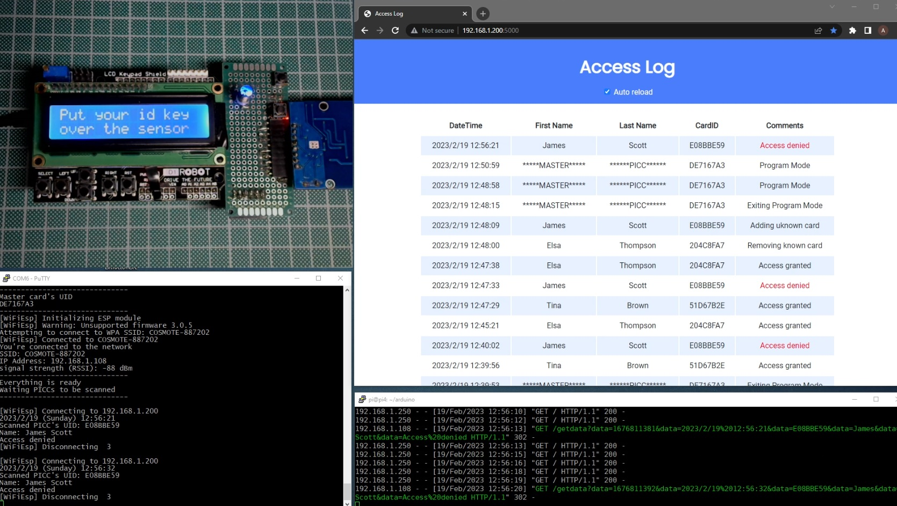
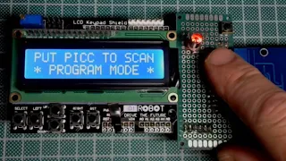
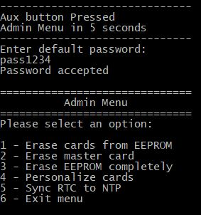
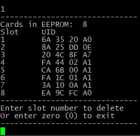
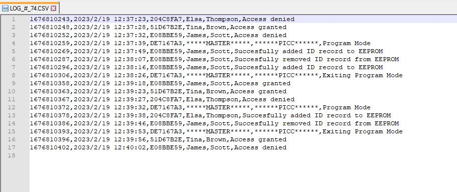

# NFC/RFID access control and logging
My final project for CS50x

## Video demo

## Description

Arduino based NFC/RFID access control and logging solution,
that includes a Flask web page for real time monitoring.

## Table of Contents

- [Hardware](#Hardware)
- [Software](#Software)
- [Basic standalone usage](#Basic-standalone-usage)
- [Initial setup](#Initial-setup)
- [Admin menu](#Admin-menu)
- [SD Card](#SD-card-logging)
- [Web page](#Web-page)

## Hardware
Since this is for CS50, I won't go into much detail about the hardware.
I used the following:

- Arduino Mega 2560 with built in ESP8266 WiFi (RobotDyn).
- MFRC-522 13.56MHz nfc/rfid reader.
- Data Logger Shield with SD card and real time clock (Adafruit).
- LCD Keypad Shield.
- Simple custom board with RGB led and button(s).

Basic connections:
- Ardunino and ESP8266 WiFi, communicate using hardware serial.
- MFRC-522 uses SPI.
- SD card uses SPI and RTC uses I2C.
- LCD Keypad uses parallel and analog.

## Software

The software consists of two parts:
1. The core part (Arduino's v2.0.x IDE).
- I tried to split the project in several files so it could better organized and more readable.
- I used a lot of functions and made some classes.
- The device can work standalone but for the more advanced stuff, needs usb serial connection.
- Good WiFi reception is needed, otherwise use the ntp version where WiFi is used only for ntp sync.

2. The web part (vscode + flask + sqlite3 on a Raspberry 4.
- I tried to make a simple web page much like CS50's birthdays.
- Pagination not done - I hope I will do it in CS50w :)
- Arduino's web client "prints" data to the server using GET.
- The web page can be set to auto reload for real time monitoring.

## Basic standalone usage

1. Place a card over the reader. The device reads the card's id and searches the EEPROM for a match.
If there is a positive match, the RGB LED turns green, a record is created in the web server's database
and (if implemented) a relay can unlock a door, barricade, or similar blocking mechanism. If there is not
a match, the RGB LED turns red, the relay remains off and a record in red shows in the web page.

2. To add or remove a card's id in EEPROM, we need to have the "Master" card which is created during the initial setup.
After we place the master card over the reader, the device enters "Program mode". Then we place the card it's status
want to change. If the card's id is found in the EEPROM, then is deleted, otherwise added. When we finish adding and removing
cards, we place the master card again to return to normal mode.

3. If a card is lost/unavailable and we want to remove it from EEPROM, we enter program mode using the master card and then
press the aux button for 5 sec. Using the lcd and up/down buttons, we select the id we want to remove and then press the select
button. The id selected is deleted after 3 sec. After we finish, we press the reset button to restart the device.
To use this method, we need to know the card's id in advance.

## Initial setup

The device cannot be used until we complete the next step. 
For the initial setup, we need to connect the device's USB port to a computer and either use Arduino's IDE serial console
or putty or minicom etc. After we select the correct com port, if it's the first use of the device, we are asked for the
default password. The password is set in the firmware and we need to re-flash the device if we want to change it.
After giving the correct password, we are asked to set up a master card. We place a card over the reader and that is registered
as a master card from now on. Now we can use this master card to enter program mode and add cards as described above. 
The device is now ready for use.

## Admin menu

To enter the admin menu, we need to connect USB as above and while in normal mode, press the aux button for 5 sec.
After entering the default password, the admin menu is displayed:

1. The first option displays the cards in EEPROM. We can select one to delete.

When finished, we press 0 to return to main menu.

2. Selecting the second option, we delete the master card and reboot.
Then we must complete again the initial step, as described above.

3. Selecting the third option, we delete all EEPROM contents and reboot.
Then we have to complete again the initial step, once more.

4. This option is for storing user's first name and family name in a MIFARE card
We place the card on the reader and select option 4.
We are asked to type the user's family name followed by #.
Then, do the same for user's first name. 
We shouldn't move the card until success is displayed. 
We can continue writing to more cards. After we finished, we press reset to reboot.

5. The device has built in Real Time Clock with a lithium battery but occasionally we might need to set the correct time.
We select the fifth option for that. Before we flash the firmware, we set our time zone and ntp server of choice.
We let it sync a few times. Then, we press reset to reboot.

## SD card logging

The device logs most actions to SD card 

## Web page

I made an auto reload function for the web page but besides that,
the functionality and the display are spartan.

While minimal, it can be used as a starting point to add more features like
filtered views, replicating or even replacing EEPROM, serving more than one device etc.
I might continue overhauling this project for CS50w and CS50ai adding QRcode camera or
AI camera for face recognition.

